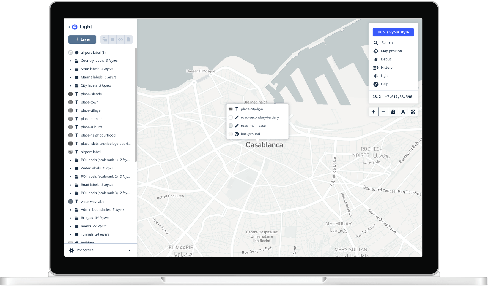

# Maps and location for developers

Precise location data and powerful developer tools to change the way we navigate the world.

Official site: <https://www.mapbox.com/>

## Mapbox Studio

- Create custom maps
- Upload custom data as tilesets
- Create data visualizations
- Draw data in the dataset editor

Manual: <https://docs.mapbox.com/studio-manual/overview/>

This manual contains a comprehensive explanation of each section of Mapbox Studio, including general descriptions of individual components and detailed information on specific tools. It can be used either as a reference when using specific tools in Mapbox Studio, or as a way to understand the general pieces of how a Mapbox map is constructed.

- [**Overview**](https://docs.mapbox.com/studio-manual/overview/): Conceptual explanations of the map components and workflows in Mapbox Studio.
- [**Examples**](https://docs.mapbox.com/studio-manual/examples/): A collection of style examples you can browse and add to your account.
- [**Help**](https://docs.mapbox.com/studio-manual/help/): Troubleshooting guides and step-by-step tutorials for creating styles in Mapbox Studio and using them in web and mobile applications.
- [**Reference**](https://docs.mapbox.com/studio-manual/reference/): Comprehensive descriptions of the Mapbox Studio interface.

## My styles

| Name | Description |
| ---- | ----------- |
| Basic | The best way to get started. |
| Light | Subtile light backdrop for data visualizations. |
| Dark |  Subtile dark backdrop for data visualizations. |
| Streets | A complete basemap, perfect for incorporating your own data.
| Navigation Preview Day | Traffic on a light streets basemap that highlights congestion. |

Following is a python script to access them quickly.